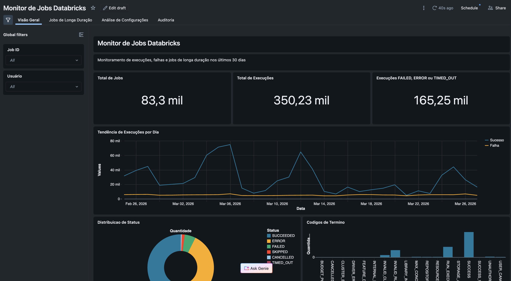
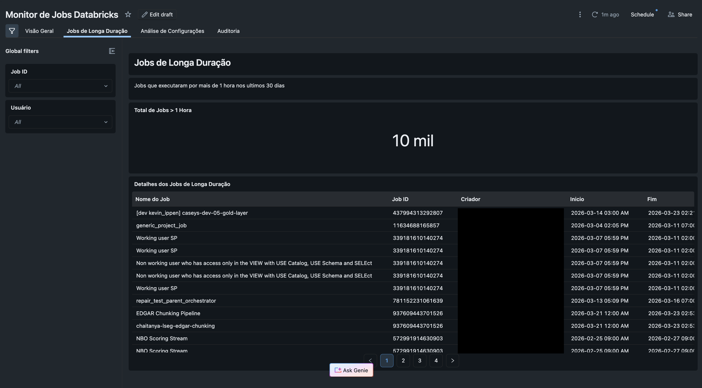
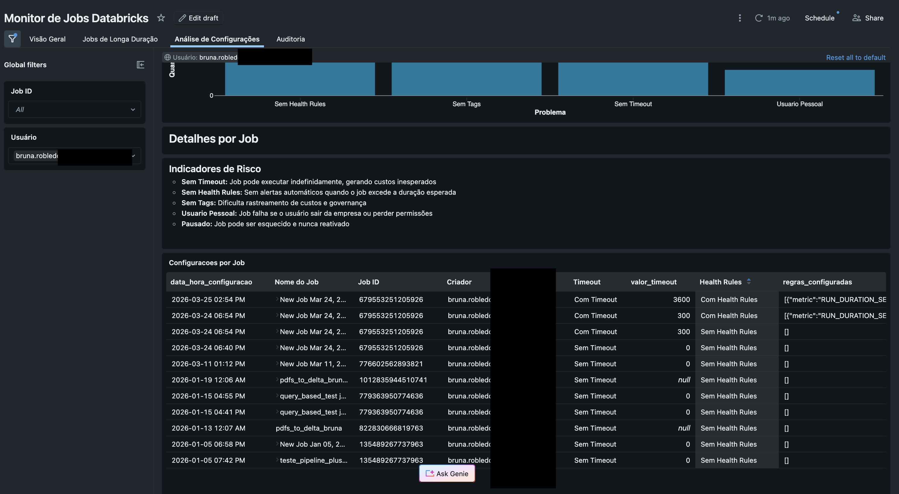
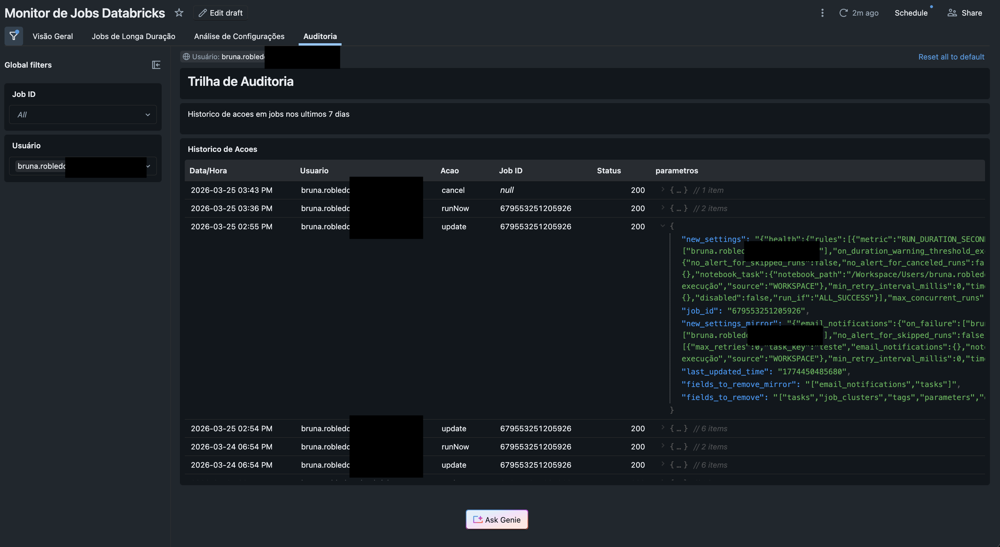
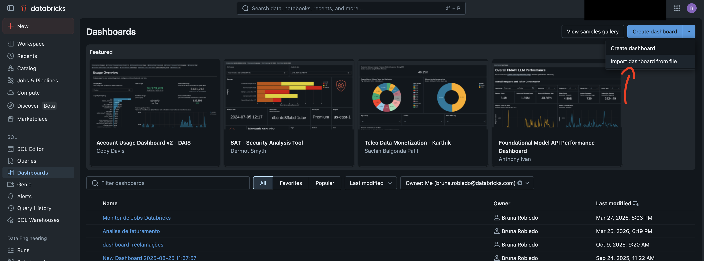

# Databricks Jobs Monitor

Dashboard e script de monitoramento para jobs Databricks usando System Tables (Lakeflow) e Audit Logs.

## Visão Geral

Este projeto contém:

1. **Dashboard Lakeview** (`dashboard.lvdash.json`) - Dashboard interativo para monitoramento de jobs
2. **Script Watchdog** (`script_job.py`) - Script Python para alertar e cancelar jobs de longa duração

## Dashboard

O dashboard monitora jobs Databricks nos últimos 30 dias, com foco em:

- **KPIs principais**: Total de jobs, execuções e falhas
- **Tendência de execuções**: Gráfico de sucesso vs falhas por dia
- **Jobs de longa duração**: Execuções que excederam 1 hora
- **Análise de configurações**: Identifica jobs com configurações de risco
- **Auditoria**: Trilha de ações nos últimos 7 dias

### Screenshots

#### Visão Geral


#### Jobs de longa duração


#### Análise de configurações


#### Auditoria


## Pré-requisitos

- Workspace Databricks com Unity Catalog habilitado
- Acesso às System Tables:
  - `system.lakeflow.jobs`
  - `system.lakeflow.job_run_timeline`
  - `system.access.audit`
- SQL Warehouse para executar as queries

## Instalação do Dashboard

#### Como importar


1. Importe o arquivo `dashboard.lvdash.json` no seu workspace Databricks
2. Configure os filtros conforme necessário
3. O dashboard se conectará automaticamente às System Tables

## Script Watchdog

O script `script_job.py` monitora jobs em execução e alerta quando excedem o tempo limite configurado.

### Configuração

```python
MAX_RUNTIME_HOURS = 5/60  # Tempo máximo antes de alertar (em horas)
AUTO_CANCEL = True        # Se True, cancela automaticamente jobs que excedem o limite
OWNER_ONLY = True         # Se True, filtra apenas jobs do usuário atual
DATABRICKS_PROFILE = "databricks-profile"  # Profile do Databricks CLI
```

### Uso

```bash
# Instalar dependências
pip install databricks-sdk

# Executar
python script_job.py
```

### Exemplo de Saída

```
Iniciando watchdog - Limite: 0.083h | Owner: usuario@empresa.com
--------------------------------------------------
⚠️ Encontrado(s) 2 job(s) excedendo 0.083h:

  • Job de ETL Diário
    Tempo: 2.5h | Por: usuario@empresa.com
    URL: https://workspace.databricks.com/jobs/123/runs/456

🛑 Auto-cancel ativado. Cancelando jobs...
Job cancelado: Job de ETL Diário (run_id: 456)
```

## Indicadores de Risco Monitorados

| Indicador | Descrição | Impacto |
|-----------|-----------|---------|
| Sem Timeout | Job pode executar indefinidamente | Custos inesperados |
| Sem Health Rules | Sem alertas automáticos | Falhas não detectadas |
| Sem Tags | Dificulta rastreamento | Governança comprometida |
| Usuário Pessoal | Job executa como usuário | Falha se usuário sair |

## System Tables Utilizadas

### `system.lakeflow.jobs`
- Metadados de jobs (nome, criador, configurações)
- Timeout, health rules, tags
- Status (ativo/pausado/deletado)

### `system.lakeflow.job_run_timeline`
- Histórico de execuções
- Duração, status, códigos de término
- Timestamps de início e fim

### `system.access.audit`
- Trilha de auditoria
- Ações: create, update, delete, runNow, cancel
- Parâmetros e usuário responsável

